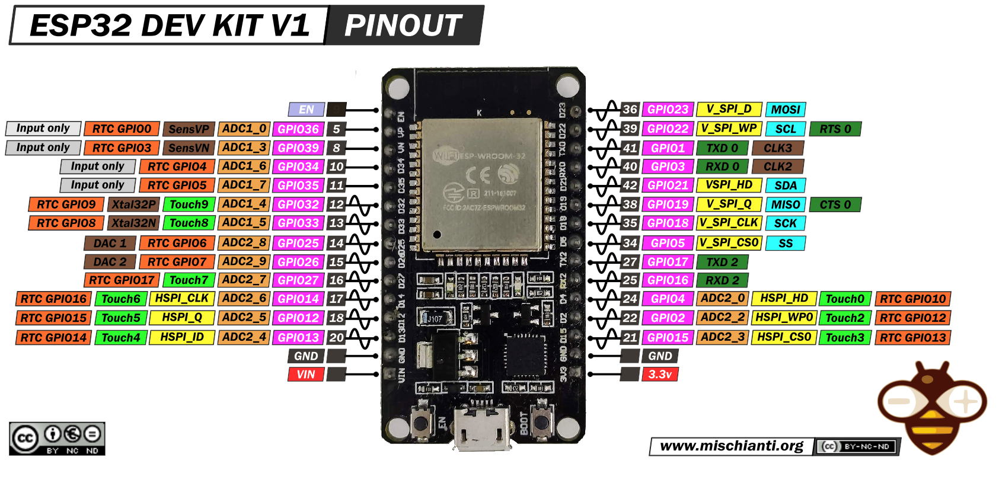

# Wiring

**All specified pins are GPIO pins, not physical pin numbers**

### Power
* Solder 2 pins each to PD positive and negatives terminals. Verify that PD output is 9V
* Solder 1 pin each to the 5V buck converter's IN pins
* Temporarily hook up the buck converter to the PD and adjust the voltage until the output reads ~5.2V
* Solder 3 pins each to the buck converter's OUT pins. You want to solder one of the pins to the output terminal and then take a small length of bare wire and solder it across all 3 pins on the other side of the board, so as to create a poor man's bus bar. Test fit things first - the negative bus bar should go "up" towards the pen shaft, while the positive bus bar should go parallel to the bottom edge, with the buck converter's outputs being on the left and intput on the right. In general, it doesn't matter in which orientation you solder them as long as you're not obstructing the cover or any other components
* Hook up the first set of PD pins to ESP32 Vin and Gnd pins using 10cm jumper wire. ESP32 has an onboard 3.3V regulator and can accept any voltage between 5V and 12V
* Connect the other two pins from the PD to the 5V buck converter + / - pins using 20cm wire

## Servo
* Use an exacto knife to lift the plastic tabs on the servo connector and remove the 3pin plastic housing
* Do the same thing to a couple of jumper wires to collect 1pin plastic housings. Put them onto servo wires and make sure the plastic tabs engage and don't let the wires pop out
* Connect servo Vin and Gnd wires to the buck converter's output bus bars
* Connect the signal wire to GPIO 2

## Left motor controller
* \- / + go to buck converter's output bus bars
* IN1 -> 27
* IN2 -> 14
* IN3 -> 12
* IN4 -> 13

## Right motor controller
* \- / + go to buck converter's output bus bars
* IN1 -> 26
* IN2 -> 25
* IN3 -> 33
* IN4 -> 32

## OLED Screen
* VCC -> 3.3V pin on ESP32
* GND -> GND pin on ESP32
* SLC -> 22
* SDA -> 21
